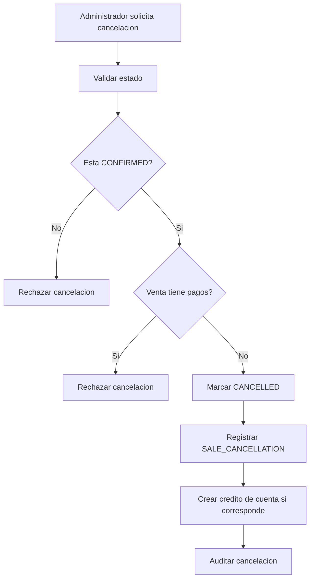

# Cancelacion de pedido

```mermaid
flowchart TD
    A[Administrador solicita cancelacion] --> B[Validar estado]
    B --> C{Esta CONFIRMED?}
    C -->|No| D[Rechazar cancelacion]
    C -->|Si| E{Venta tiene pagos?}
    E -->|Si| F[Rechazar cancelacion]
    E -->|No| G[Marcar CANCELLED]
    G --> H[Registrar SALE_CANCELLATION]
    H --> I[Crear credito de cuenta si corresponde]
    I --> J[Auditar cancelacion]
```
