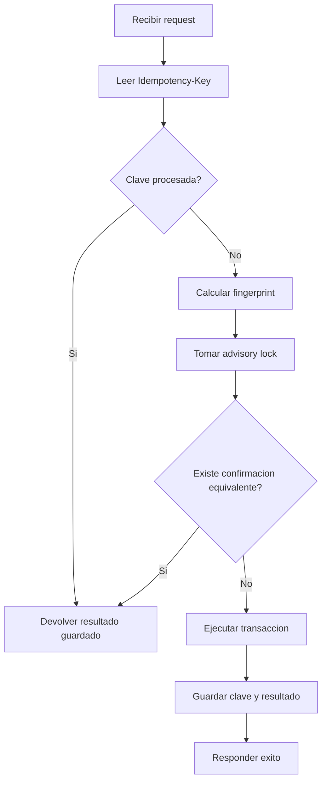

# Idempotencia de confirmacion

```mermaid
flowchart TD
    A[Recibir request] --> B[Leer Idempotency-Key]
    B --> C{Clave procesada?}
    C -->|Si| D[Devolver resultado guardado]
    C -->|No| E[Calcular fingerprint]
    E --> F[Tomar advisory lock]
    F --> G{Existe confirmacion equivalente?}
    G -->|Si| D
    G -->|No| H[Ejecutar transaccion]
    H --> I[Guardar clave y resultado]
    I --> J[Responder exito]
```
