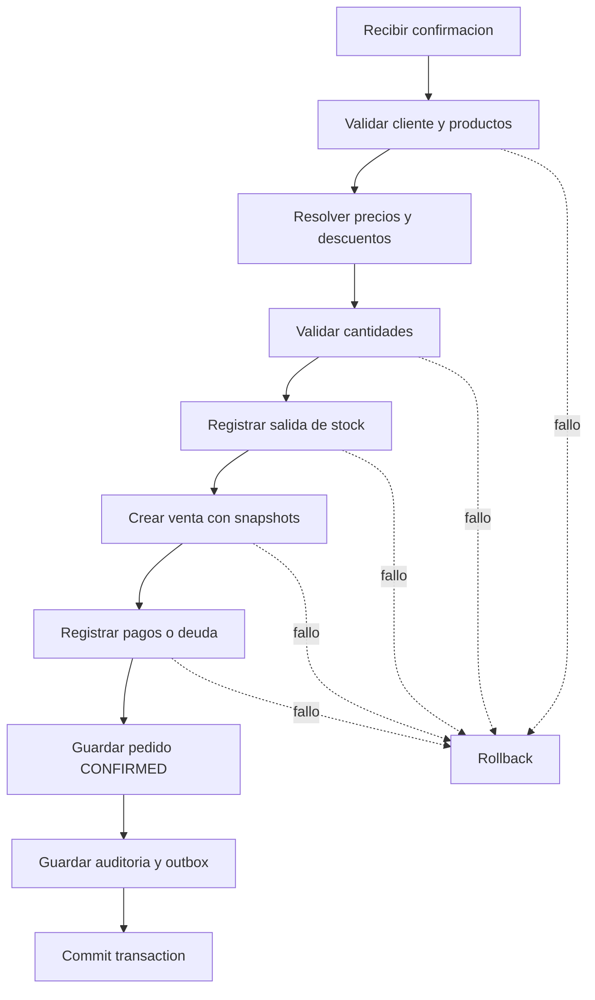

# Transaccion de confirmacion

```mermaid
flowchart TD
    A[Recibir confirmacion] --> B[Validar cliente y productos]
    B --> C[Resolver precios y descuentos]
    C --> D[Validar cantidades]
    D --> E[Registrar salida de stock]
    E --> F[Crear venta con snapshots]
    F --> G[Registrar pagos o deuda]
    G --> H[Guardar pedido CONFIRMED]
    H --> I[Guardar auditoria y outbox]
    I --> J[Commit transaction]
    B -. fallo .-> K[Rollback]
    D -. fallo .-> K
    E -. fallo .-> K
    F -. fallo .-> K
    G -. fallo .-> K
```
