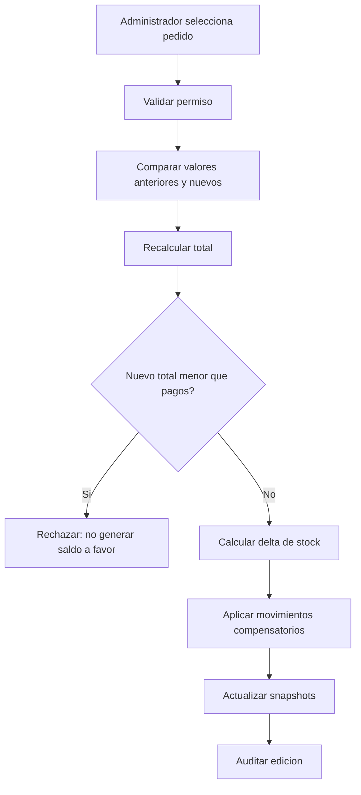

# Edicion de pedido confirmado

```mermaid
flowchart TD
    A[Administrador selecciona pedido] --> B[Validar permiso]
    B --> C[Comparar valores anteriores y nuevos]
    C --> D[Recalcular total]
    D --> E{Nuevo total menor que pagos?}
    E -->|Si| F[Rechazar: no generar saldo a favor]
    E -->|No| G[Calcular delta de stock]
    G --> H[Aplicar movimientos compensatorios]
    H --> I[Actualizar snapshots]
    I --> J[Auditar edicion]
```
