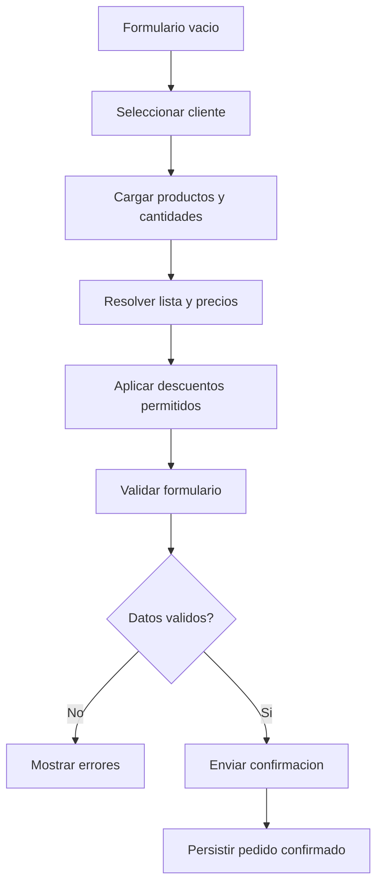

# Creacion de pedido

```mermaid
flowchart TD
    A[Formulario vacio] --> B[Seleccionar cliente]
    B --> C[Cargar productos y cantidades]
    C --> D[Resolver lista y precios]
    D --> E[Aplicar descuentos permitidos]
    E --> F[Validar formulario]
    F --> G{Datos validos?}
    G -->|No| H[Mostrar errores]
    G -->|Si| I[Enviar confirmacion]
    I --> J[Persistir pedido confirmado]
```
