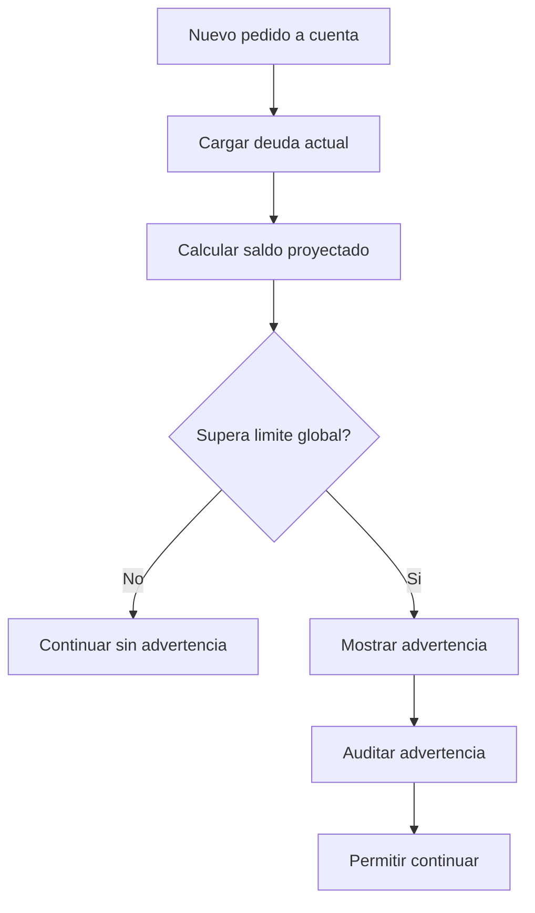

# Advertencia de limite de credito

```mermaid
flowchart TD
    A[Nuevo pedido a cuenta] --> B[Cargar deuda actual]
    B --> C[Calcular saldo proyectado]
    C --> D{Supera limite global?}
    D -->|No| E[Continuar sin advertencia]
    D -->|Si| F[Mostrar advertencia]
    F --> G[Auditar advertencia]
    G --> H[Permitir continuar]
```
