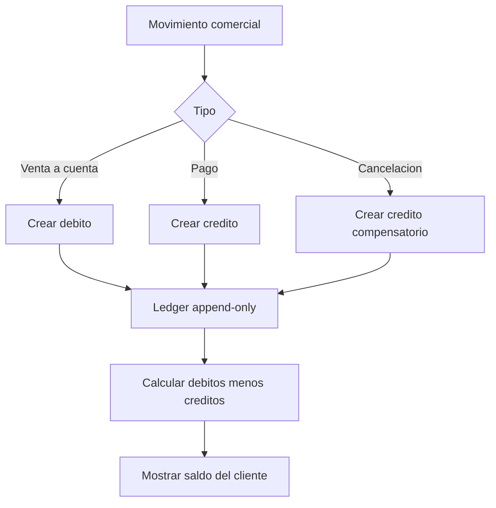

# Cuenta corriente y ledger

```mermaid
flowchart TD
    A[Movimiento comercial] --> B{Tipo}
    B -->|Venta a cuenta| C[Crear debito]
    B -->|Pago| D[Crear credito]
    B -->|Cancelacion| E[Crear credito compensatorio]
    C --> F[Ledger append-only]
    D --> F
    E --> F
    F --> G[Calcular debitos menos creditos]
    G --> H[Mostrar saldo del cliente]
```
