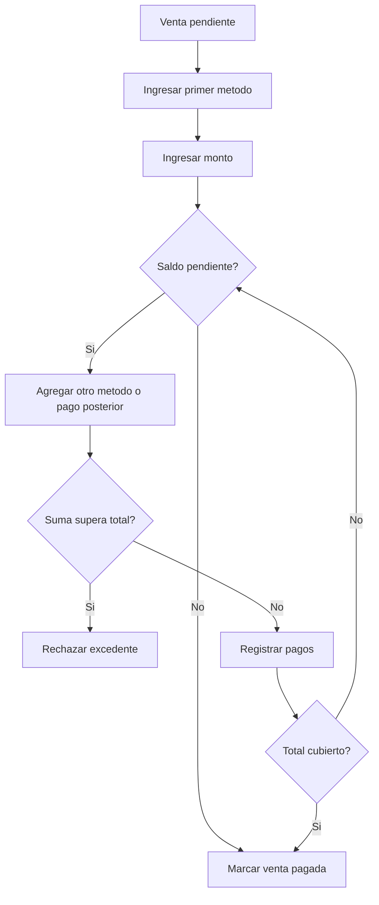

# Pagos parciales y combinados

```mermaid
flowchart TD
    A[Venta pendiente] --> B[Ingresar primer metodo]
    B --> C[Ingresar monto]
    C --> D{Saldo pendiente?}
    D -->|Si| E[Agregar otro metodo o pago posterior]
    D -->|No| F[Marcar venta pagada]
    E --> G{Suma supera total?}
    G -->|Si| H[Rechazar excedente]
    G -->|No| I[Registrar pagos]
    I --> J{Total cubierto?}
    J -->|No| D
    J -->|Si| F
```
