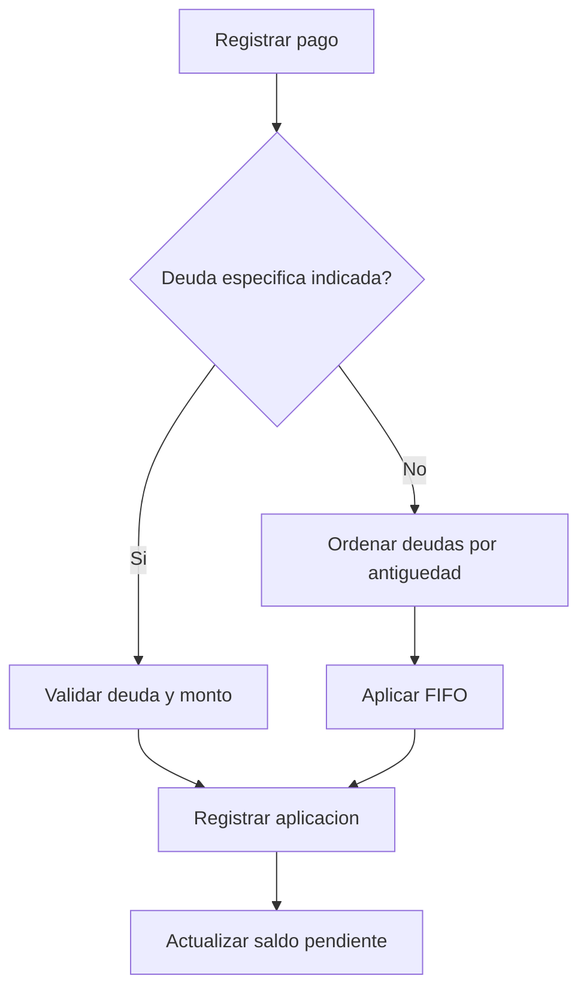

# Aplicacion de pagos

```mermaid
flowchart TD
    A[Registrar pago] --> B{Deuda especifica indicada?}
    B -->|Si| C[Validar deuda y monto]
    B -->|No| D[Ordenar deudas por antiguedad]
    D --> E[Aplicar FIFO]
    C --> F[Registrar aplicacion]
    E --> F
    F --> G[Actualizar saldo pendiente]
```
