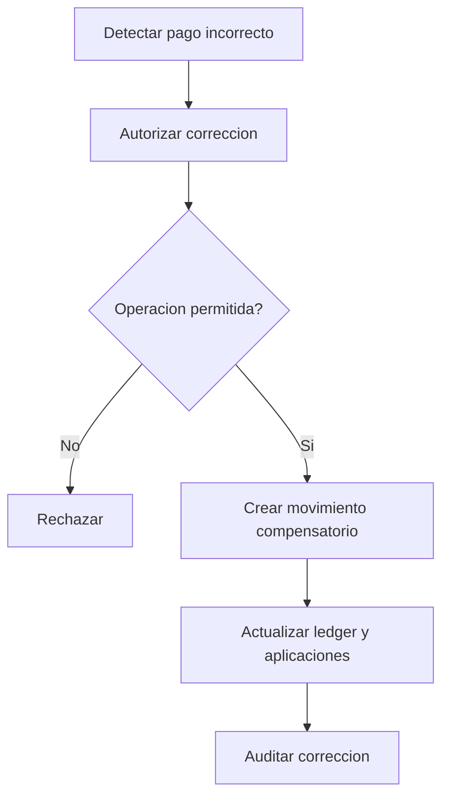

# Correccion de pago

```mermaid
flowchart TD
    A[Detectar pago incorrecto] --> B[Autorizar correccion]
    B --> C{Operacion permitida?}
    C -->|No| D[Rechazar]
    C -->|Si| E[Crear movimiento compensatorio]
    E --> F[Actualizar ledger y aplicaciones]
    F --> G[Auditar correccion]
```
