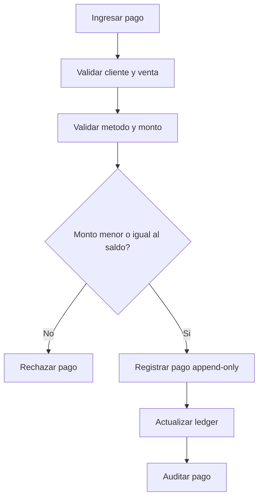

# Registro de pago

```mermaid
flowchart TD
    A[Ingresar pago] --> B[Validar cliente y venta]
    B --> C[Validar metodo y monto]
    C --> D{Monto menor o igual al saldo?}
    D -->|No| E[Rechazar pago]
    D -->|Si| F[Registrar pago append-only]
    F --> G[Actualizar ledger]
    G --> H[Auditar pago]
```
