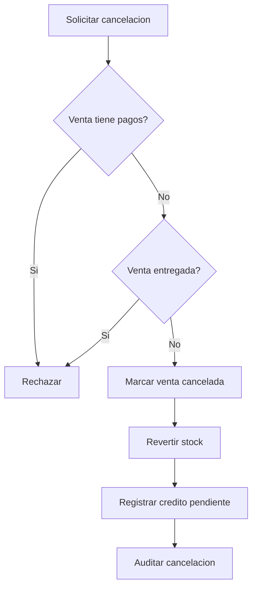

# Cancelacion de venta

```mermaid
flowchart TD
    A[Solicitar cancelacion] --> B{Venta tiene pagos?}
    B -->|Si| C[Rechazar]
    B -->|No| D{Venta entregada?}
    D -->|Si| C
    D -->|No| E[Marcar venta cancelada]
    E --> F[Revertir stock]
    F --> G[Registrar credito pendiente]
    G --> H[Auditar cancelacion]
```
