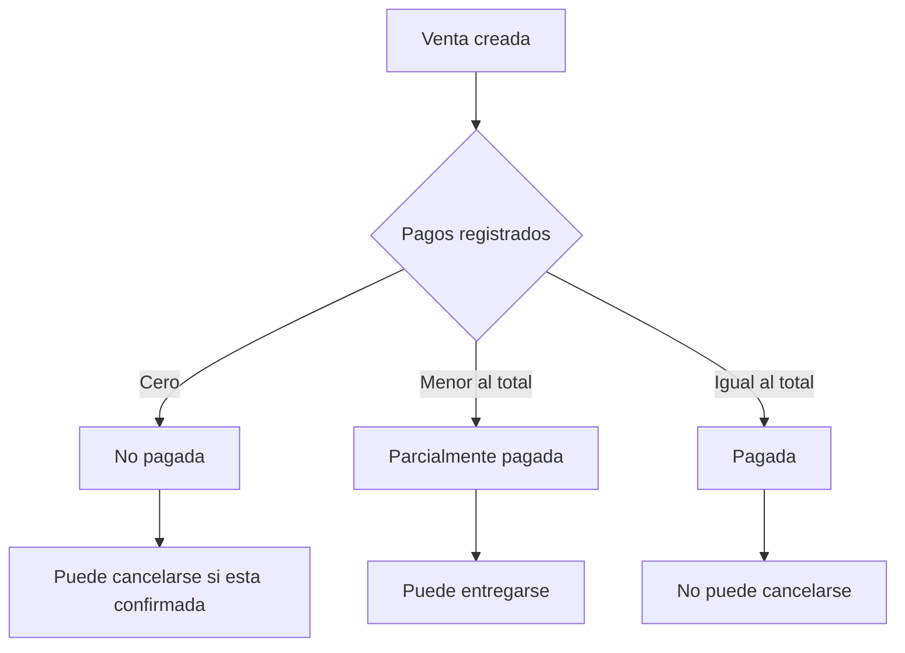

# Estado de pago de la venta

```mermaid
flowchart TD
    A[Venta creada] --> B{Pagos registrados}
    B -->|Cero| C[No pagada]
    B -->|Menor al total| D[Parcialmente pagada]
    B -->|Igual al total| E[Pagada]
    C --> F[Puede cancelarse si esta confirmada]
    D --> G[Puede entregarse]
    E --> H[No puede cancelarse]
```
