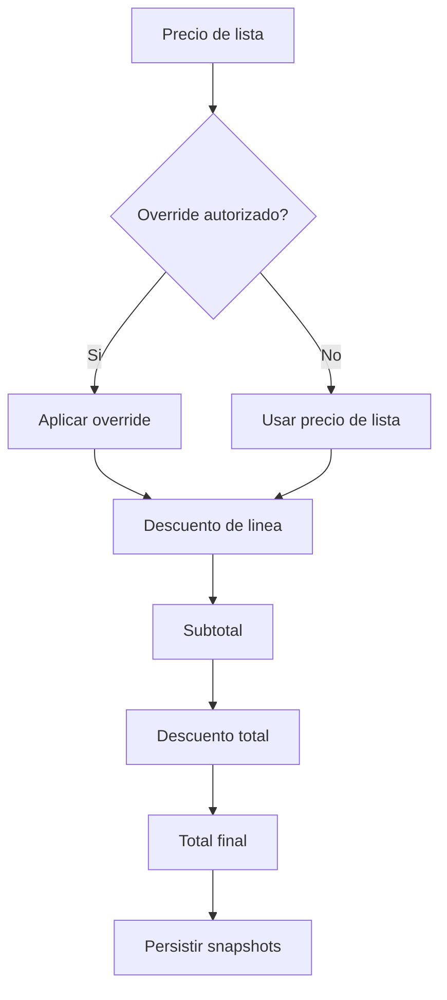

# Calculo del total de venta

```mermaid
flowchart TD
    A[Precio de lista] --> B{Override autorizado?}
    B -->|Si| C[Aplicar override]
    B -->|No| D[Usar precio de lista]
    C --> E[Descuento de linea]
    D --> E
    E --> F[Subtotal]
    F --> G[Descuento total]
    G --> H[Total final]
    H --> I[Persistir snapshots]
```
