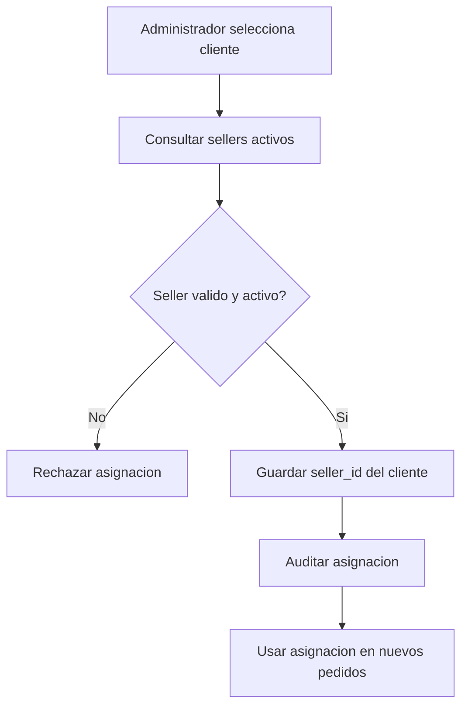

# Asignacion de vendedor

```mermaid
flowchart TD
    A[Administrador selecciona cliente] --> B[Consultar sellers activos]
    B --> C{Seller valido y activo?}
    C -->|No| D[Rechazar asignacion]
    C -->|Si| E[Guardar seller_id del cliente]
    E --> F[Auditar asignacion]
    F --> G[Usar asignacion en nuevos pedidos]
```
