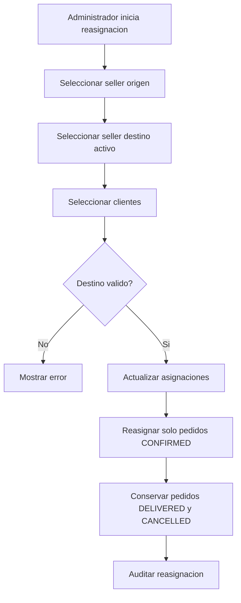

# Reasignacion masiva de clientes

```mermaid
flowchart TD
    A[Administrador inicia reasignacion] --> B[Seleccionar seller origen]
    B --> C[Seleccionar seller destino activo]
    C --> D[Seleccionar clientes]
    D --> E{Destino valido?}
    E -->|No| F[Mostrar error]
    E -->|Si| G[Actualizar asignaciones]
    G --> H[Reasignar solo pedidos CONFIRMED]
    H --> J[Conservar pedidos DELIVERED y CANCELLED]
    J --> I[Auditar reasignacion]
```
