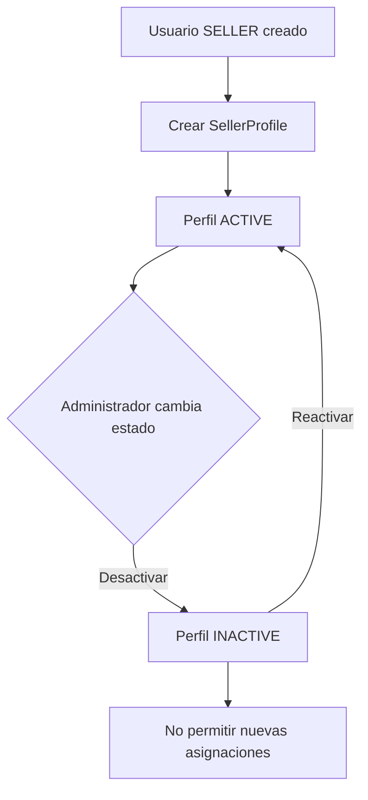

# Ciclo de vida del perfil seller

```mermaid
flowchart TD
    A[Usuario SELLER creado] --> B[Crear SellerProfile]
    B --> C[Perfil ACTIVE]
    C --> D{Administrador cambia estado}
    D -->|Desactivar| E[Perfil INACTIVE]
    E -->|Reactivar| C
    E --> F[No permitir nuevas asignaciones]
```
