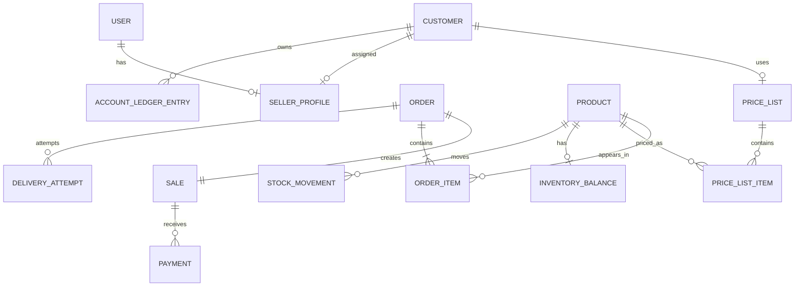

# Resumen del dominio

## Contexto

El sistema administra el ciclo comercial de una empresa: clientes, productos,
precios, pedidos, ventas, stock, pagos, entregas y documentos.

## Agregados y entidades principales

| Concepto | Módulo | Responsabilidad |
|---|---|---|
| `User` | identity | identidad, estado y credenciales |
| `Role` | identity | agrupación de permisos |
| `Permission` | identity | autorización concreta |
| `SellerProfile` | seller | capacidad comercial de un usuario |
| `Customer` | customer | datos y cuenta comercial del cliente |
| `Brand` | catalog | marca del producto |
| `Product` | catalog | artículo vendible y controlado por stock |
| `PriceList` | catalog | conjunto de precios comerciales |
| `Order` | order | solicitud comercial antes y después de confirmar |
| `Sale` | sale | registro comercial derivado del pedido |
| `InventoryBalance` | inventory | saldo actual |
| `StockMovement` | inventory | historial de movimientos |
| `Payment` | payment | importe y método de pago |
| `AccountLedgerEntry` | payment | deuda y aplicaciones de cuenta corriente |
| `DeliveryAttempt` | order | intento de entrega y resultado |
| `Document` | document | metadata y representación documental |
| `AuditEntry` | audit | trazabilidad de operaciones |

## Relaciones principales



## Invariantes

- Una venta siempre nace de un pedido confirmado.
- Confirmar crea venta y salida de stock dentro de la misma transacción.
- El stock puede ser negativo.
- Los movimientos de stock son inmutables.
- Una venta pagada no se cancela.
- Una venta entregada no se revierte.
- No se permiten pagos superiores al saldo.
- No se generan saldos a favor.
- Los snapshots de pedido y venta no cambian por modificaciones futuras de
  listas de precios.
- Una venta parcialmente pagada puede entregarse.
- Una lista de precios dada de baja no se usa en nuevos pedidos.
- El cliente puede no tener vendedor o lista asignados.

## Flujo de precio

```text
lista del cliente si existe
→ `LISTA_1` si no existe
→ cambio manual de lista durante el pedido
→ precio de lista
→ override autorizado
→ descuento por línea
→ descuento total
→ snapshot en pedido y venta
```

## Flujo de stock

```text
confirmación → SALE
edición       → delta compensatorio
cancelación   → SALE_CANCELLATION
ajuste admin  → MANUAL_ADJUSTMENT
```

## Cuenta corriente

El saldo se obtiene desde el ledger, no desde un campo editable:

```text
deuda = débitos - créditos aplicados
```

Los pagos pueden aplicarse a una deuda específica o automáticamente al saldo
más antiguo. El límite global solo genera advertencias y no bloquea la venta.

## Estado del dominio

Los impuestos, ARCA, compras, proveedores, múltiples depósitos, reportes,
dashboard, portal de clientes, historial de costos y layouts configurables de
impresión quedan fuera del alcance inicial.
